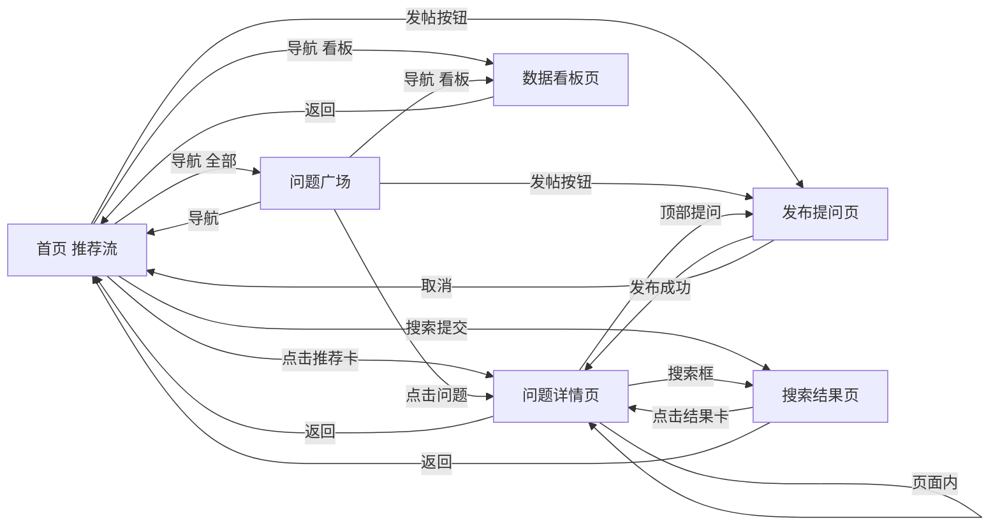

# AI 辅助论坛 — 信息架构文档

> 基于《AI 辅助论坛需求总结文档》功能模块（5.1–5.5）梳理，描述产品的页面结构、跳转关系与各页核心模块。MVP 聚焦问答场景，匿名无账号。

## 1. 页面清单

| # | 页面 | 用途 |
|---|------|------|
| P1 | 首页（推荐流） | 落地页，展示基于本地行为的个性化问题推荐流，提供全局搜索与发帖入口 |
| P2 | 问题广场 | 按最新/热度浏览全站问题列表，支持排序切换 |
| P3 | 问题详情页 | 查看问题正文与回答，触发 AI 帮我答/AI 摘要，在内联编辑器中作答 |
| P4 | 发布提问页 | 匿名发起提问，编辑器内嵌 AI 润色/扩写/生成草稿 |
| P5 | 搜索结果页 | 自然语言语义搜索，返回带来源引用的 AI 要点摘要与相关帖卡片 |
| P6 | 数据看板页 | 展示 AI 使用率与反馈指标，管理匿名身份，清空本地数据 |

## 2. 页面跳转关系

贯穿性入口说明：

- **顶栏导航**：贯穿 P1 / P2 / P6，提供首页、问题广场、数据看板三个常驻入口。
- **全局搜索框**：贯穿 P1 / P2 / P3 / P5，任意位置提交均跳转 P5。
- **发帖入口**：出现在 P1 / P2 / P3，点击进入 P4。
- **匿名身份卡**：作为浮层组件出现在 P1 / P6，非独立页面。

## 3. 各页核心模块

### P1 首页（推荐流）

- 顶栏导航
- 全局搜索框
- 为你推荐流
- 发帖入口
- 匿名身份卡

### P2 问题广场

- 顶栏导航
- 排序切换（最新 / 热度）
- 问题列表
- 发帖入口

### P3 问题详情页

- 问题正文区
- AI 摘要按钮区
- 回答列表
- AI 帮我答区
- 内联回答编辑器（含 AI 工具栏）
- 来源引用回链

### P4 发布提问页

- 标题输入
- 正文编辑器
- AI 工具栏（润色 / 扩写 / 生成草稿）
- 标签输入
- 发布按钮

### P5 搜索结果页

- 搜索框
- AI 要点摘要（带引用）
- 相关帖卡片列表

### P6 数据看板页

- AI 使用率卡片
- 功能触发分布
- 反馈有用率
- 匿名身份卡
- 清空本地数据
